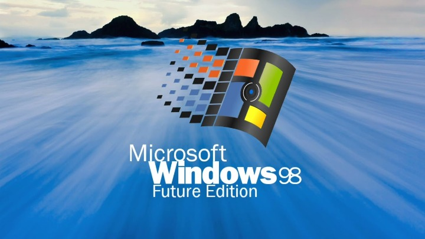

#  [web98lite](https://web98lite.vercel.app/)

A web based Windows98 recreation - lite version.

Includes:
*  Notepad
*  Internet Explorer
*  My Documents
*  Recycle Bin
*  Minesweeper (Lite & Full version)
*  Help Center

Features:
* Browse through the nostalgia ride of Windows 98, bit-sized.
* Update to latest Web98 for new theme.
* Play the vintage Minesweeper (full version made by me ;).
* Write your thoughts on Notepad.
* Surf through old Internet by using our own IE!

## Try it out

[ ＥＮＴＥＲ　　ＷＥＢ　９８　河ご移](https://web98lite.vercel.app/)

ｔｈｅ　ｆｕｔｕｒｅ　ｉｓ　ｈｅｒｅ．

Other genuine online operating systems / web desktops: (source: [1j01/98](https://github.com/1j01/98))

| Name & Link                                                                                           | Vague Description                | Repo & License                                                                                                                                         | Chat                                    |
|-------------------------------------------------------------------------------------------------------|----------------------------------|--------------------------------------------------------------------------------------------------------------------------------------------------------|-----------------------------------------|
| [&nbsp;98.js.org](https://98.js.org/)                                              | Inspired from this guy        | [repo here](https://github.com/1j01/98/) - shared source                                                                           | [Discord](https://discord.com/invite/SyFweYjTKx)                                        |
| [&nbsp;Rahul.io](https://rahul.io/)                                              | another Windows 98 remake        | [repo here](https://github.com/lolstring/window98-html-css-js) - MIT license                                                                           |                                         |
| [&nbsp;Windows&nbsp;93](https://www.windows93.net/)             | a "fictional version of Windows" | (not open source currently)                                                                                                                            | [Discord](https://discord.gg/vAmMu7q)   |
| [🏡 ZineOS](https://whimsy.space/)                                                                     | emojis everywhere                | [repo here](https://github.com/STRd6/zine) - MIT license                                                                                               | [Discord](https://discord.gg/tUj4zYA)   |
| [&nbsp;EmuOS](https://emupedia.net/beta/emuos/)                      | emulator-focused Win9X desktop   | [repo here](https://github.com/Emupedia/emupedia.github.io) - shared source                                                                            | [Discord](https://discord.gg/5u4VR9v)   |
| [&nbsp;OS.js](https://www.os-js.org/)                                | a more serious web desktop       | [repo here](https://github.com/os-js/OS.js) - simplified BSD license                                                                                   | [Gitter](https://gitter.im/os-js/OS.js) |
| [&nbsp;CloudDesk](http://altaica.altervista.org/)                | another serious one              | (explicitly not open source)                                                                                                                           |                                         |
| [&nbsp;AaronOS](https://aaronos.dev/AaronOS/aosBeta.php)           | interesting aesthetic            | [repo here](https://github.com/MineAndCraft12/AaronOS) - shared source                                                                                 | [Discord](https://discord.gg/eWDac7E)   |
| [&nbsp;WinXP](https://winxp.vercel.app/)                            | Windows XP                       | [repo here](https://github.com/ShizukuIchi/winXP/) - MIT license                                                                                       |                                         |
| [&nbsp;vue win3.1](https://disjfa.github.io/vue-win-3.1/)       | Windows 3.1                      | [repo here](https://github.com/disjfa/vue-win-3.1) - shared source                                                                                     |                                         |
| [&nbsp;Puter](http://puter.com/)      | MacOS like UI, with own apps   | [repo here](https://github.com/HeyPuter/puter) - different license |  [Discord](https://discord.com/invite/PQcx7Teh8u)                                                                                                                                                       |                                         |
| [&nbsp;Web&nbsp;Desktop](https://webdesktop.net/)               | Windows 10 like "startpage"      |                                                                                                                                                        |                                         |
| [GUIdebook](https://guidebookgallery.org/guis/windows/)                                               | Screenshots, several OSes        |                                                                                                                                                        |                                         |

## Development Setup

- [Clone the repository.](https://docs.github.com/en/github/creating-cloning-and-archiving-repositories/cloning-a-repository)
- Open the repo folder in IDE like VS Code.
- Select the index.html file.
- Click on Run & Debug button (<kbd>Ctrl</kbd>+<kbd>Shift</kbd>+<kbd>D</kbd>)
- Enjoy the web98 offline! 🥤
